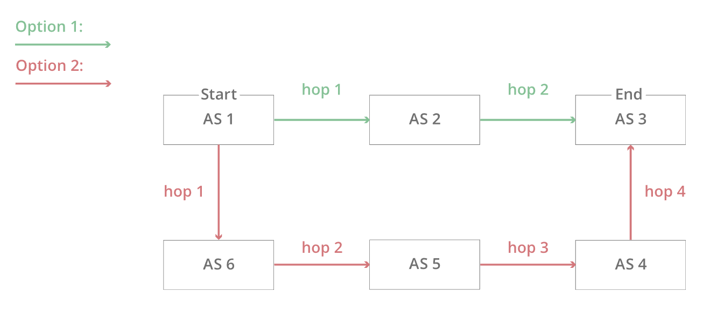
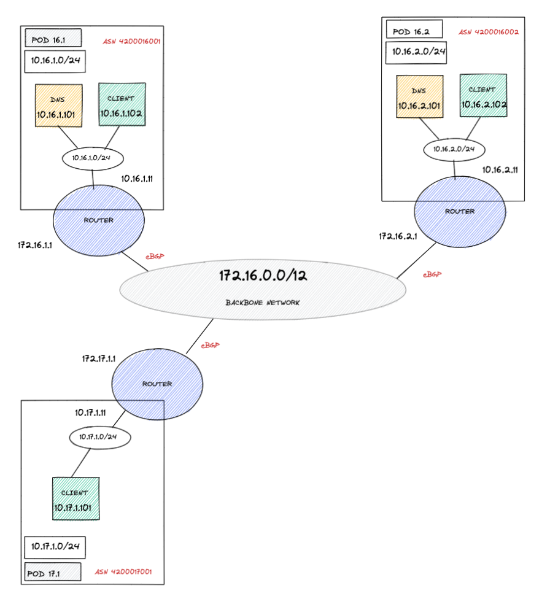

### BGP & The Internet

17 Nov, 2021

Sriram Viswanathan

---

### Notes before I start 

* Everything is going to be simplified to death.

* I just read all of this over last couple of weeks - **so please do ask questions**, no pressure. 

* **My hope**: you get curious and break the internet, isn't that what it's meant for ? (just kiddin...)   

---

### But first, a brief refresher

* Networking stack - Layers.

* BGP -> Application Layer protocol - works on top of TCP -> Transport Layer protocol.

* Other examples of application layer protocols are HTTP, DNS.

* IP address CIDR - <a target="_blank" href="https://ipaddressguide.com/cidr" title="CIDR to IP">CIDR to IP</a>

---

### The Internet - network of networks

* "Delivery System"

* Based on cooperation (but for a fee)

---

### Autonomous System (AS)

* Big networks that make up the Internet
* One network or multiple networks (CIDRs) - address blocks
* ASes do not like to be alone - connect to several other ASes

---

### Things about an AS 

* Can I buy one, please 🙋 ?  Sure can 🎉... but you need to be fairly big...as a company 😐

* **ASN** - Autonomous System Number - Uniquely identifies every AS globally

* Who assigns this ? Regional Internet Registries (RIRs) => IANA (**Global**) -> APNIC (RIR for **APAC**) -> IRINN (RIR for **India**)

* Examples of ASN in India - Jio, <a target="_blank" href="https://dnslytics.com/bgp/as45609" title="Airtel ASN">Airtel ASN</a>, Amazon.in etc..

---

### How do ASes talk to each other ?

* Peering points or Internet Exchange Points (IXPs) - E.g. <a target="_blank" href="https://www.peeringdb.com/net/1903" title="Airtel Peers">Airtel Peers</a>

* Layer2 networks - Ethernet switches - same network

* It's like a conference where you pay to do 'networking' - literally!

* E.g. <a target="_blank" href="https://www.de-cix.in/connected-networks" title="DE-CIX Exchange">DE-CIX Exchange</a>
---

### BGP - 3 napkin protocol

* Invented by Yakov Rekhter and Kirk Lougheed - on 3 pieces of napkin paper 🧐

    

In 1989, Yakov Rekhter and Kirk Lougheed sketched on three napkins their plan for routing data across the Internet. The “three-napkins protocol,” officially known as the Border Gateway Protocol, was intended to be a quick fix but still governs how long-haul traffic flows through cyberspace. Rekhter’s re-creation of those sketches is seen here.

---

### What is BGP ?

* Protocol for routing data packets between ASes

* ASes use BGP to **announce** which IP addresses they are responsible for

* BGP routers update their `routing table` based on incoming announcements

* IXPs usually create one-to-one (static) BGP connections. 

---

### BGP Routing Path
* Not always based on hop count
* Cost factor - neighbouring AS maybe owned by competing businesses
* Always changing - dynamic routes 

---

### BGP Misconfiguration - what can happen ?

* Delays in transmission

* Data stolen by malicious actors

* Data disappears completely 

---

### What happened at Facebook ?

* BGP misconfiguration - stopped advertisements of certain CIDR blocks

* These blocks included their 'authoritative' DNS nameservers

* Small TTL for DNS records - 'non-authoritative' DNS servers 'forget' after a short time

* Once forgotten, they do not know how to reach `facebook.com` 😔

---

### Demo Time 🥼

Welcome to.....

---

### Pocket internet!

---

### What do we need to do simulate ? - Happy Path

* Check initial path from `POD 16.2`'s client to `POD 16.1`'s DNS

* Check that `POD 16.2`'s DNS is acting like a non-authoritative DNS - its caching for TTL duration

* Check ASN path from `POD 16.2`'s `bird` instance to both ASNs

---

### Let's break the DNS 

* Withdraw `4200016001` BGP advertisements

* ASN `4200016002` no longer will know how to get to the DNS in `POD 16.1`

* Try resolving domain managed by DNS with non-ah - accessible BUT only for TTL

* Once TTL expires, we are in a bad place unfortunately 

---

### Do we have time ? 🙂

---

### Let's replay!

<a target="_blank" href="https://stat.ripe.net/special/bgplay#bgplay_fetch.resource=129.134.30.0/23&bgplay_fetch.ignoreReannouncements=true&bgplay_fetch.starttime=1633363200&bgplay_fetch.endtime=1633366800&bgplay_fetch.rrcs=0,1,2,3,4,5,6,7,10,11,13,14,15,16,18,20&bgplay_fetch.instant=null&bgplay_fetch.type=bgp" title="BGP Play">BGP Play</a>

---

### Hope this was as fun for you as it was for me! 

Thanks! 🙂
